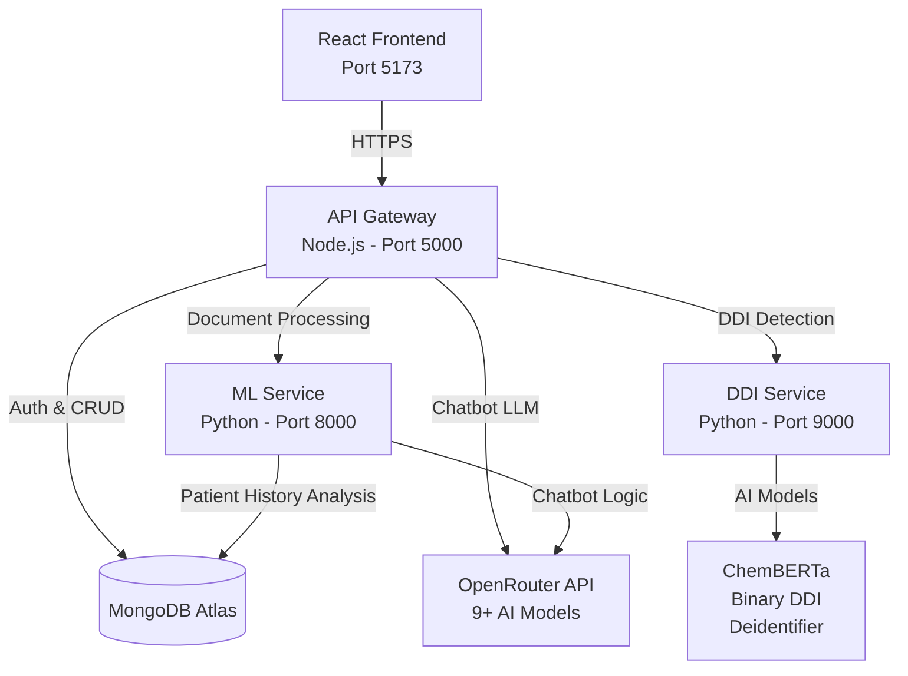
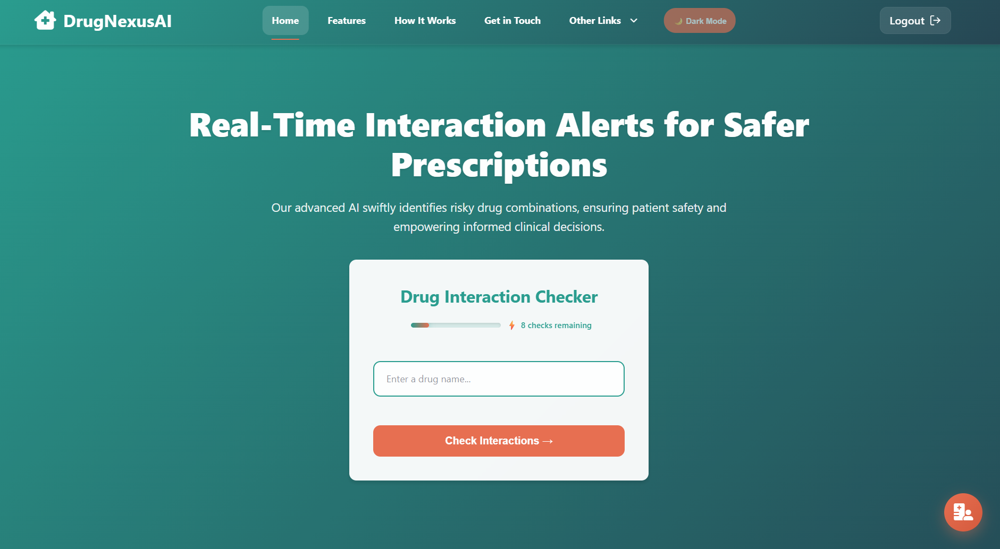
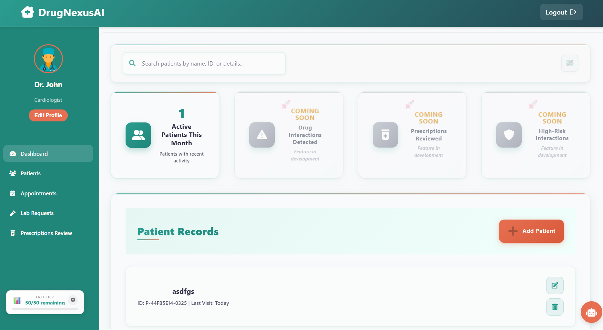
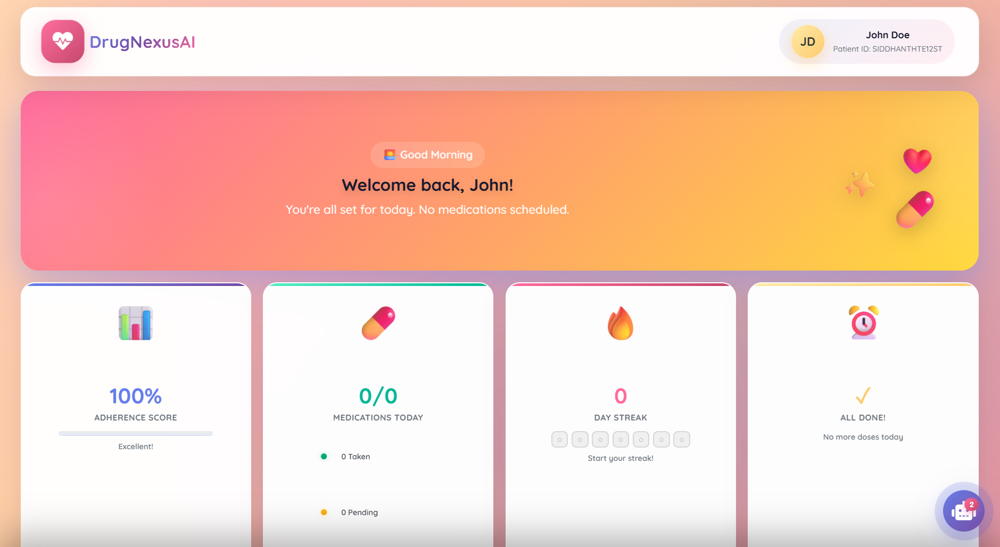
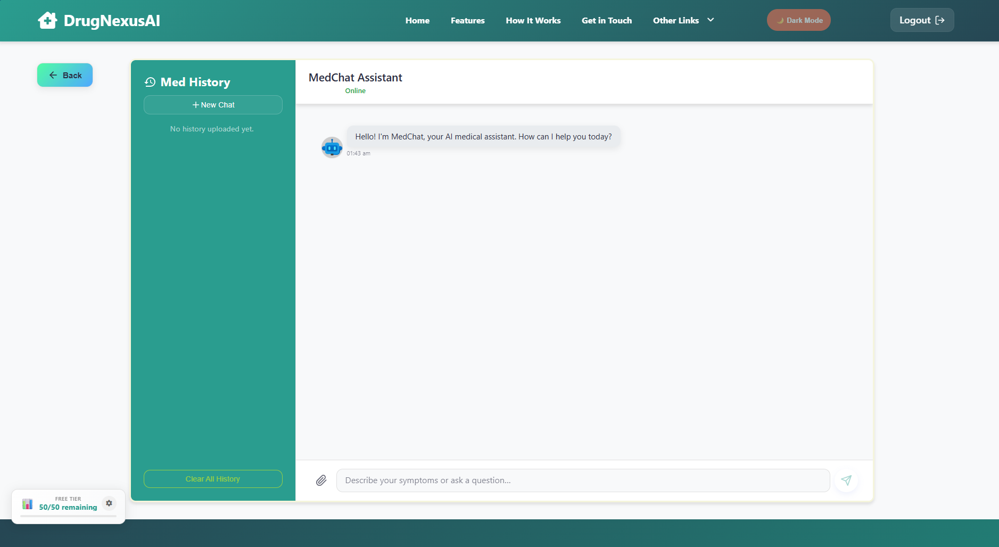
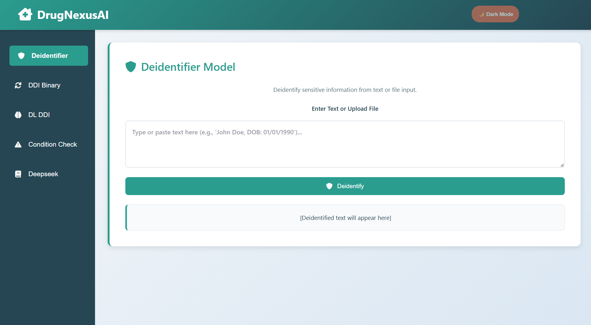

<div align="center">

# 💊 DrugNexusAI

### AI-Powered Drug Interaction Intelligence Platform

[](https://drugnexusai.app/)
[](./LICENSE)
[](https://github.com/SIDDHANTH-THAKURI/healthcare-ai-suite)

*Intelligent Clinical Decision Support System for Drug-Drug Interaction Detection*

[Features](#-features) • [Quick Start](#-quick-start) • [Architecture](#-architecture) • [Demo](#-demo)

</div>

---

## 🎯 Overview

DrugNexusAI is a production-ready Clinical Decision Support System (CDSS) that combines advanced AI models with intuitive interfaces to help healthcare professionals and patients identify potentially dangerous drug interactions.

**Key Highlights:**
- 🧠 Multiple AI models for precise DDI classification
- 💬 Intelligent chatbot with 9+ LLM fallback options
- 👨‍⚕️ Comprehensive doctor and patient portals
- 🔐 Enterprise-grade security with JWT authentication
- ☁️ Multi-cloud deployment architecture

---

## ✨ Features

<table>
<tr>
<td width="70%">

### 👨‍⚕️ Doctor Portal
- Patient management dashboard
- Real-time DDI checking
- Prescription creation & tracking
- Medical document management
- Consultation history

</td>
<td width="70%">

### 🧑‍⚕️ Patient Portal
- Medication tracking
- 7-day adherence streaks
- AI health assistant
- Prescription history
- Plain-language explanations
- Appointments Tracking

</td>
</tr>
<tr>
<td width="70%">

### 🔬 Models Playground
- Deidentifier (Stanford AI)
- Binary DDI predictor
- Deep learning classifier
- SMILES-based analysis
- Interactive testing

</td>
<td width="70%">

### 🤖 AI Chatbot
- Multi-model fallback system
- Context-aware responses
- Intent detection
- Medication queries
- Health recommendations

</td>
</tr>
</table>

---

## 🏗️ Architecture



**Service Breakdown:**
- **Frontend**: React + TypeScript UI
- **API Gateway**: Authentication, database operations, routing, chatbot API calls
- **ML Service**: Document processing (PDF/DOCX), patient history analysis, chatbot logic
- **DDI Service**: Drug interaction AI models (deidentifier, binary predictor, DL classifier)
- **MongoDB**: User accounts, prescriptions, patients, chat history
- **OpenRouter**: LLM API for chatbot (DeepSeek, GPT-4, Llama, etc.)

### Tech Stack

| Layer | Technologies |
|-------|-------------|
| **Frontend** | React 18, TypeScript, Vite |
| **Backend** | Node.js, Express.js, FastAPI |
| **AI/ML** | ChemBERTa, DeepSeek, Custom DL Models |
| **Database** | MongoDB Atlas |
| **Deployment** | Vercel, AWS App Runner, Render |

---

## 🚀 Quick Start

### Prerequisites

```bash
Node.js >= 18.0.0
Python >= 3.11
MongoDB Atlas account
OpenRouter API key
```

### Installation

```bash
# Clone repository
git clone https://github.com/SIDDHANTH-THAKURI/healthcare-ai-suite.git
cd Personalised_DDI_Checker

# Install dependencies
npm run install:all

# Install Python packages
cd apps/ml-service && pip install -r req.txt
cd ../ddi-service && pip install -r requirements.txt
cd ../..
```

### Configuration

Create `.env` in root directory:

```env
MONGO_URI=your_mongodb_connection_string
JWT_SECRET=your_jwt_secret_key
OPENROUTER_API_KEY=your_openrouter_api_key
DB_NAME=MedPortalDB
COLLECTION_NAME=drugs
```

### Run Application

```bash
# Start all services
npm run dev:all

# Or start individually:
npm run dev:web    # Frontend → http://localhost:5173
npm run dev:api    # API Gateway → http://localhost:5000
npm run dev:ml     # ML Service → http://localhost:8000
npm run dev:ddi    # DDI Service → http://localhost:9000
```

---

## 📸 Demo

<div align="center">

### 🏠 Landing Page


### 👨‍⚕️ Doctor Dashboard


### 🧑‍⚕️ Patient Dashboard


### 🤖 AI Assistant


### 🔬 Models Playground


</div>

---

## 📁 Project Structure

```
Personalised_DDI_Checker/
├── apps/
│   ├── web/              # React frontend (Port 5173)
│   ├── api-gateway/      # Express API (Port 5000)
│   ├── ml-service/       # FastAPI ML (Port 8000)
│   └── ddi-service/      # FastAPI DDI (Port 9000)
├── packages/
│   ├── types/            # Shared TypeScript types
│   └── utils/            # Shared utilities
├── docs/                 # Documentation
├── scripts/              # Build & deployment scripts
└── config/               # Configuration files
```

---

## 🌐 Deployment

DrugNexusAI uses a multi-cloud architecture for optimal performance:

| Service | Platform | Purpose |
|---------|----------|---------|
| **Frontend** | Vercel | Global CDN, instant deployments |
| **API Gateway** | AWS App Runner | Scalable Node.js backend |
| **ML Services** | Render | Python FastAPI microservices |
| **Database** | MongoDB Atlas | Managed cloud database |

**Benefits:**
- ✅ High availability and resilience
- ✅ Independent service scaling
- ✅ Cost optimization
- ✅ Global performance

---

## 🔐 Security

- JWT-based authentication
- Role-based access control (RBAC)
- HTTPS/SSL encryption
- Environment variable protection
- HIPAA-compliant data handling
- AI-powered deidentification

---

## 🎓 Academic Context

Originally developed as part of CSIT998 Capstone Project at University of Wollongong (2025), this project has been significantly extended with:

- Enhanced UI/UX with modern design patterns
- Production-ready multi-cloud deployment
- Advanced AI integration (9+ LLM models)
- Comprehensive security implementation
- Full-stack TypeScript migration
- Extensive documentation

---

## 🤝 Contributing

Contributions are welcome! Here's how:

1. Fork the repository
2. Create feature branch (`git checkout -b feature/AmazingFeature`)
3. Commit changes (`git commit -m 'Add AmazingFeature'`)
4. Push to branch (`git push origin feature/AmazingFeature`)
5. Open Pull Request

---

## 📝 License

This project is licensed under the MIT License - see [LICENSE](./LICENSE) file for details.

---

## 📬 Contact

<div align="center">

**Siddhanth Thakuri**

[](mailto:thakurisiddhanth1@gmail.com)
[](https://github.com/SIDDHANTH-THAKURI/)
[](https://www.linkedin.com/in/siddhanththakuri/)

</div>

---

## 🙏 Acknowledgments

- University of Wollongong for academic support
- DrugBank for drug interaction database
- OpenRouter for LLM API access
- Stanford AI for deidentification models
- Kiro AI for development assistance and code optimization
- Open-source community for amazing tools

---

<div align="center">

### ⭐ Star this repo if you find it helpful!

**Version 2.0.0** • **Last Updated: October 2025** • **Status: Active Development** 🚀

[Report Bug](https://github.com/SIDDHANTH-THAKURI/healthcare-ai-suite/issues) • [Request Feature](https://github.com/SIDDHANTH-THAKURI/healthcare-ai-suite/issues) • [Documentation](./docs/)

</div>
